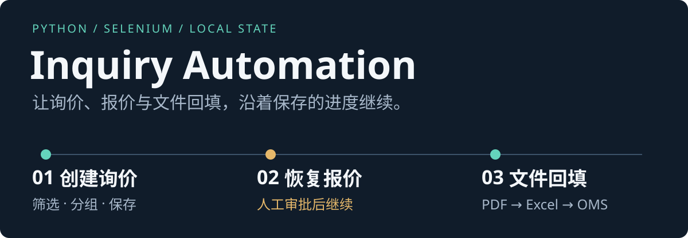

<p align="center">
  
</p>

# Inquiry Automation · 询价流程自动化

**把跨系统的询价、报价和文件回填，组织成可暂停、可恢复的阶段任务。**

基于 Python、Selenium 与 Edge，将 OMS 数据筛选、备件门户操作及 PDF / Excel 处理串联起来；Tkinter 启动器提供阶段入口、日志与人工继续操作。

[工作流程](#工作流程) · [离线体验](#离线体验) · [配置与运行](#配置与运行) · [代码导览](#代码导览) · [验证与限制](#验证与限制)

> 基于实习业务场景独立重构的脱敏演示版本，不包含企业源代码、真实业务数据、账号凭据或内部系统地址。公开仓库可用于阅读代码和运行离线测试；完整浏览器流程需要经授权的目标环境及部署配置。

## 先看一个状态交接

任务进度会写入本地 JSON，供后续阶段读取。以下字段节选自仓库自带的[询价示例](inquiry_results.example.json)，仅用于解释数据结构：

```json
{
  "inquiry_no": "DEMO-INQUIRY-001",
  "project_name": "脱敏演示项目",
  "oms_cart_total_quantity": 1,
  "oms_sourcing_no": "DEMO-SOURCING-001",
  "quotation_no": "DEMO-QUOTE-001"
}
```

`inquiry_no` 标识询价任务，`quotation_no` 衔接后续报价处理，`oms_sourcing_no` 关联回填目标。阶段三结果另见[归档示例](finalize_results.example.json)。这些是合成示例，不是已执行的业务记录。

## 工作流程

| 阶段 | 完成的工作 | 交接状态 |
| --- | --- | --- |
| **01 创建询价** | 筛选 OMS 列表、按项目或关联字段分组，在备件门户创建询价单 | `oms_data.json`、`inquiry_results.json` |
| **02 审批后恢复** | 操作员确认审批完成后，继续加入购物车、核对数量、生成报价单 | `inquiry_last.json` |
| **03 文件回填** | 导出 PDF / Excel，解析报价、填充供应商报价表并导回 OMS | `finalize_results.json` |

人工审批与业务判断保留人工控制。遇到页面异常、附件问题或需要确认的步骤时，程序提供人工介入与继续入口；恢复仍依赖已保存状态和目标页面实际情况。

### 值得关注的实现

- **阶段间保存状态**：JSON 文件保存任务与归档结果，减少中断后重复整理数据的工作。
- **浏览器操作封装**：显式等待、多标签页、iframe、附件下载与上传处理集中在业务模块及工具层。
- **文档处理衔接**：`pdfplumber` 提取 PDF 字段，`openpyxl` 定位 Excel 表头、填充报价信息并生成本地归档。
- **桌面操作入口**：Tkinter 启动器展示子进程输出，支持人工继续与跳过操作。

## 离线体验

建议使用 **Python 3.11+** 的独立虚拟环境；本次验证使用 Windows / Python 3.12。以下 PowerShell 命令不启动业务浏览器：

```powershell
git clone https://github.com/alethbedoyya-dot/inquiry-automation-public.git
cd inquiry-automation-public
python -m venv .venv
.\.venv\Scripts\python.exe -m pip install -r requirements.txt

# 先验证分组、输出路径和报价字段辅助逻辑
.\.venv\Scripts\python.exe -m unittest -v test_oms_grouping_email_filter test_output_paths test_quote_fill
```

图片格式转换为 JPG 时可选安装 Pillow：

```powershell
.\.venv\Scripts\python.exe -m pip install Pillow
```

无需准备账号即可阅读两份示例 JSON、查看阶段编排与运行上述测试。公开仓库没有真实系统截图；首图是依据代码绘制的阶段示意图。

## 配置与运行

浏览器流程需要 **Windows、Microsoft Edge**，以及匹配的 WebDriver 和经授权的目标系统。公开默认 URL、账号与供应商映射都是占位值，需结合实际部署配置。

```powershell
# 创建本地私有配置，按模板填写授权环境的信息
Copy-Item user_config.example.py user_config.py

# 可选：交互录入账号配置
.\.venv\Scripts\python.exe main.py --setup-config

# GUI 启动器
.\.venv\Scripts\python.exe launcher.py
```

`user_config.py` 已被 Git 忽略。支持覆盖的配置项按 **同名环境变量 → 本地配置 → 公共默认值** 的顺序读取，具体字段见[配置模板](user_config.example.py)和 [config.py](config.py)。

也可以按阶段从命令行启动：

```powershell
# 阶段一：创建询价
.\.venv\Scripts\python.exe main.py

# 阶段二：确认人工审批完成后恢复
.\.venv\Scripts\python.exe main.py --resume

# 阶段三：导出、填表、导入并提交
.\.venv\Scripts\python.exe main.py --finalize --import-submit
```

**阶段三包含业务写入。** 当前 `FINALIZE_IMPORT_SUBMIT` 默认为 `True`，省略 `--import-submit` 不等于只预览；执行前请确认目标环境和待导入内容。

<details>
<summary>常用参数与本地产物</summary>

| 参数 | 用途 |
| --- | --- |
| `--step-by-step` | 逐步执行，每步人工确认 |
| `--inquiry-results PATH` | 指定阶段读取的询价 JSON |
| `--finalize-only pdf\|excel\|fill\|import` | 选择阶段三的处理步骤 |
| `--close-browser` | 流程结束后关闭 Edge |
| `--no-manual-recovery` | 遇错直接退出，不进入人工恢复 |

完整参数可用 `.\.venv\Scripts\python.exe main.py --help` 查看；可选环境检查入口为 `setup.py`。

状态文件、`logs/`、`cache/`、`sessions/`、下载文件、截图与报价文档均为本地产物，可能包含业务数据，应保持在版本控制之外。

</details>

## 代码导览

| 入口 | 关注点 |
| --- | --- |
| [main.py](main.py) / [launcher.py](launcher.py) | 三阶段编排、人工恢复与桌面入口 |
| [modules/](modules/) | OMS、备件门户、购物车和报价操作 |
| [modules/quote_fill.py](modules/quote_fill.py) | PDF 字段提取与 Excel 填表 |
| [utils/inquiry_store.py](utils/inquiry_store.py) | 状态保存、归档与恢复路径选择 |
| [utils/](utils/) | 分组、浏览器、下载、图片、日志等辅助能力 |

## 验证与限制

运行全部四个离线测试模块：

```powershell
.\.venv\Scripts\python.exe -m unittest -v test_oms_grouping_email_filter test_output_paths test_quote_fill test_spareparts_photo_upload
```

本次文档核验（2026-09-12，代码基线 `036b2bc`，Windows / Python 3.12）：**35 项中 32 项通过、1 项失败、2 项跳过**。前三个模块共 19 项通过。

- 已知失败：`test_five_views_from_three_files` 仍按旧的单列表返回值断言；当前 `assign_photos_to_views()` 返回「照片路径列表、视图名列表」二元组，测试契约尚未同步。
- 两项附件测试因公开仓库没有本地附件数据而跳过。
- `test_oms_flow.py`、`test_cart_qty_align.py` 需要真实浏览器及授权配置，不属于公开可复现的离线验证，本次未运行。

这些结果是一次本地核验记录，不代表持续集成状态或真实业务流程已经验证。

## 公开资料边界

账号、Cookie、Token、内部地址、真实客户或供应商资料，以及运行状态、日志、业务附件和截图都不得提交。新增演示材料应遵循 [assets/demo/README.md](assets/demo/README.md)，只使用经检查的脱敏运行结果；浏览器自动化应在明确授权后使用。
