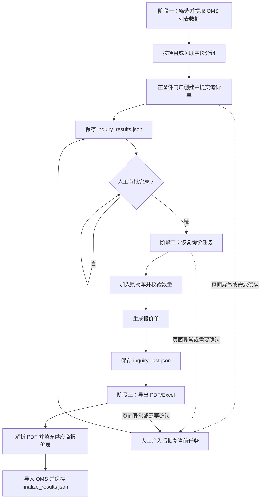

# Inquiry Automation

> 本项目为基于实习业务场景独立重构的脱敏演示版本，不包含企业源代码、真实业务数据、账号凭据及内部系统地址。

## 项目简介

这是一个使用 Python 与 Selenium 实现的询价—报价流程自动化演示项目。它将跨系统的重复操作拆分为可恢复的阶段任务，并结合浏览器自动化、JSON 状态保存、PDF/Excel 处理、Tkinter 启动器和离线单元测试，展示业务自动化项目的工程化实现方式。

公开仓库仅提供可配置的脱敏模板：默认地址、账号和供应商映射均为占位值。没有经授权的目标环境和本地配置时，不能也不应执行真实业务操作。

## 业务问题

询价与报价流程通常涉及多个系统、人工审批和文件回传。重复的筛选、分组、表单填写、购物车数量核对、报价文件导出及结果回填容易出现漏项、重复处理或中断后无法继续的问题。

本项目聚焦于以下可自动化部分：

- 从 OMS 列表筛选并按项目或关联字段分组处理数据。
- 在备件门户创建询价单，并在审批完成后恢复后续任务。
- 校验购物车数量、生成报价单、导出 PDF/Excel，并将填充后的结果导回 OMS。
- 在关键阶段保存本地状态；浏览器页面异常或人工确认时可暂停并继续，而不是从头执行。

人工审批、账号授权和涉及业务判断的步骤保留人工控制，不把它们描述为无人值守自动化。

## 自动化解决方案

`main.py` 负责多阶段编排；OMS 与备件门户模块封装 Selenium 操作；`utils/` 提供浏览器、下载、图片、分组、日志和状态保存能力；阶段三使用 `pdfplumber` 与 `openpyxl` 处理报价文件。`launcher.py` 则提供可视化启动与子进程状态展示。

## 三阶段工作流程



流程图仅对应当前代码中的阶段创建、`--resume`、`--finalize`、状态文件和人工恢复机制；不表示项目能够在公开环境中连接任何真实系统。

## 核心功能

| 能力 | 当前实现 |
| --- | --- |
| 多阶段任务编排 | 创建询价、审批后恢复、报价归档与回填分别由主程序的阶段流程处理。 |
| 浏览器自动化 | 基于 Selenium/Edge 的显式等待、多标签页、iframe、下载和异常恢复辅助方法。 |
| 数据分组与映射 | 对 OMS 行数据按项目及关联字段分组，并在阶段间传递必要业务字段。 |
| 状态保存与恢复 | 使用 JSON 保存待办询价、阶段二归档和阶段三结果；支持从最近可用状态继续。 |
| 文档处理 | 解析报价 PDF、定位 Excel 表头、填充报价字段并归档导出文件。 |
| 图片与附件处理 | 支持下载 OMS 附件、选择本地模板图片及上传前图片校验。 |
| 可视化启动 | Tkinter 启动器展示阶段状态、输出日志并支持人工继续/跳过操作。 |

## 技术栈

- Python 3.8+
- Selenium 4 / Microsoft Edge WebDriver
- `openpyxl`：Excel 读取、写入与报价表填充
- `pdfplumber`：PDF 文本提取与字段解析
- Tkinter：本地 GUI 启动器
- `unittest`：离线单元测试

## 项目结构

```text
.
├─ main.py                         # 三阶段编排与人工恢复入口
├─ launcher.py                     # Tkinter 启动器
├─ config.py                       # 公共默认值与本地配置加载
├─ user_config.example.py          # 本地私有配置模板
├─ modules/
│  ├─ oms*.py                      # OMS 浏览器操作、导入导出与附件处理
│  ├─ spareparts*.py               # 备件门户、购物车与报价操作
│  └─ quote_fill.py                # PDF 解析与 Excel 填充
├─ utils/                          # 浏览器、下载、分组、状态、日志等通用能力
├─ assets/
│  ├─ demo/                        # 仅存放经确认的公开脱敏演示材料
│  └─ photos/                      # 本地运行时备用图片，不提交真实业务图片
├─ test_*.py                       # 离线单元测试与授权环境手动测试
└─ requirements.txt
```

## 配置方法

1. 从模板创建本地配置文件：

   ```powershell
   Copy-Item user_config.example.py user_config.py
   ```

2. 仅在已获得授权的环境中填写账号、目标地址和部署专属映射。`user_config.py` 已被 Git 忽略，禁止提交。
3. 也可以通过同名环境变量覆盖本地配置值。公开版本中的默认 URL 均为占位地址。
4. 首次配置可使用：

   ```powershell
   python main.py --setup-config
   ```

本仓库不提供真实账号、Cookie、Token、内部地址或可用于访问业务系统的配置。

## 安装与运行方式

运行真实浏览器流程需要 Windows、Microsoft Edge、Python 3.8+ 与已授权的目标环境。建议使用虚拟环境：

```powershell
python -m venv .venv
.\.venv\Scripts\Activate.ps1
python -m pip install -r requirements.txt
```

可选环境检查脚本：

```powershell
python setup.py
```

启动方式：

```powershell
# GUI 启动器
python launcher.py

# 阶段一：创建询价
python main.py

# 阶段二：从已保存状态恢复
python main.py --resume

# 阶段三：导出、填表、导入
python main.py --finalize --import-submit
```

常用选项包括 `--close-browser`、`--step-by-step`、`--inquiry-results PATH` 和 `--finalize-only pdf|excel|fill|import`。运行前请确认仅使用脱敏测试数据或已授权环境。

## 状态保存与任务恢复机制

阶段之间不会仅依赖浏览器内存状态：

- `oms_data.json`：保存从 OMS 提取并分组的数据。
- `inquiry_results.json`：保存阶段一创建的待办询价，供 `--resume` 继续使用。
- `inquiry_last.json`：保存阶段二完成后的询价归档。
- `finalize_results.json`：保存阶段三处理状态与结果。
- `logs/`、`cache/`、会话备份、报价文件与运行截图：均为本地运行产物，必须保持在版本控制之外。

程序在关键步骤保留恢复入口；当网页状态异常、附件上传失败或需要操作员确认时，可暂停并从已保存任务继续。状态文件和输出文件可能包含业务数据，不能作为公开演示素材。

## 测试说明

### 离线单元测试

下列测试使用本地代码和测试数据，不应访问真实 OMS、备件门户或账号：

```powershell
python -m unittest -v test_oms_grouping_email_filter test_output_paths test_quote_fill test_spareparts_photo_upload
```

覆盖范围包括 OMS 分组与邮件筛选、输出路径处理、PDF/Excel 字段辅助函数、图片上传前的校验与映射逻辑。

### 需要真实浏览器和授权环境的手动测试

以下脚本依赖 Selenium、浏览器以及经授权的本地配置；公开仓库使用占位地址，因此不应在公开环境运行：

```powershell
python test_oms_flow.py
python test_cart_qty_align.py
```

它们用于受控环境中的人工验证，不应被解读为公开可复现的端到端测试。

## 演示截图说明

`assets/demo/` 预留给后续的公开演示材料。目前仓库不包含运行截图，以避免误上传真实系统页面、业务附件或个人信息。

后续仅可加入真实运行后完成脱敏的材料，例如隐藏账号、地址、项目名称和业务编号后的启动器截图，或由离线测试实际产生的测试结果截图。不得使用仿造公司系统的图片，也不得将真实业务单据作为演示资源。

## 脱敏与隐私说明

本项目为基于实习业务场景独立重构的脱敏演示版本，不包含企业源代码、真实业务数据、账号凭据及内部系统地址。

- 公开代码中的 URL、账号、供应商映射和示例编号均为占位内容。
- `user_config.py`、运行状态、日志、缓存、下载文件、截图和文档输出均应保持本地且被 `.gitignore` 排除。
- 任何新增截图、测试夹具或文档都必须在提交前人工检查，确认不含账号、Cookie、Token、个人信息、内部地址、真实项目或供应商数据。
- 本仓库用于展示 Python 自动化的工程思路；使用自动化脚本前应获得目标系统及数据处理的明确授权。
